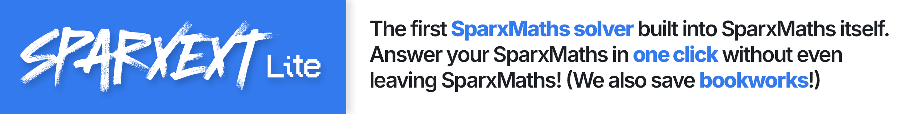

To get the full version of SparxExt Lite which does SparxMaths/Science/Reader get it at [discord.gg/pSdX84dh2J](https://discord.gg/pSdX84dh2J). 
SparxExt Lite is a simpler open source version of SparxExt, which answers questions using Gemini

<h2>↓ Installation</h2>

### Getting a Gemini API key.
1. Go to [aistudio.google.com/apikey](https://aistudio.google.com/apikey)
2. CLick the `🔑 Create API Key` button and follow the steps to get the API key.
3. Copy the API key to clipboard.

### Downloading the extension
1. Download and unzip the latest release from the `Releases` tab on the right
2. Go inside the `INSTALL` folder into the `main` folder, to find the `sparxmaths.js`
3. Open it in Notepad, TextEdit, or an IDE, and in the fifth line, replace the XXXXs in the quotes with your api key

### Installing it in your browser
1. Open Chrome/Edge/Opera/Brave and go to `chrome://extensions`
2. Click `Load unpacked` and navigate to the INSTALL folder.
3. That's it! When going to SparxMaths, the extension should be activated.  

<h2>⚙ Usage</h2>
To use the extension, look in the bottom of the screen where the `Previous` button would be 
Now, instead of a `Previous` button, the button will say "Need Help?" (this is so your teacher doesn't get suspicious) 
Click the button, and the answer card will show in the top right. In 5-10s, the answer will be loaded!

If you want a faster version, get the full version of SparxExt at [discord.gg/pSdX84dh2J](https://discord.gg/pSdX84dh2J)  

<h2>✰ Features</h2>

- 📚&nbsp;AutoBookworks™
- 🤫&nbsp;Sneaky interface
- ⚡&nbsp;Answers in 5-10s
- 🏛️&nbsp;Modern answer cards
  

<h2>Ⓒ License</h2>
You are <b>allowed to commercialise and modify</b> SparxExt Lite, and <b>distribute it</b>. You are also allowed to <b>use it privately and customise it to your liking</b>. You <b>do not carry its liability or warranty to it</b>. When commercialising, you <b>must include a License and copyright notice</b>, and <b>state the changes</b> you made. You must also <b>discolse the original source</b> of it (this GitHub repository). You must also use the same GNU General Public License v2.0 license when commercialising it.  

<h2>✐ Notes</h2>
This is a free version of my SparxExt extension. If you want a faster, and overall better extension with many more features, consider checking out the full version (you can get a 3-day free trial).

   
∗ Made by Varun 
Copyright © 2023 ⁠[varunaditya-plus](https://github.com/varunaditya-plus)
